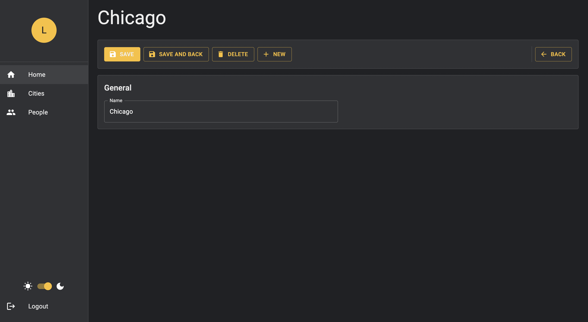
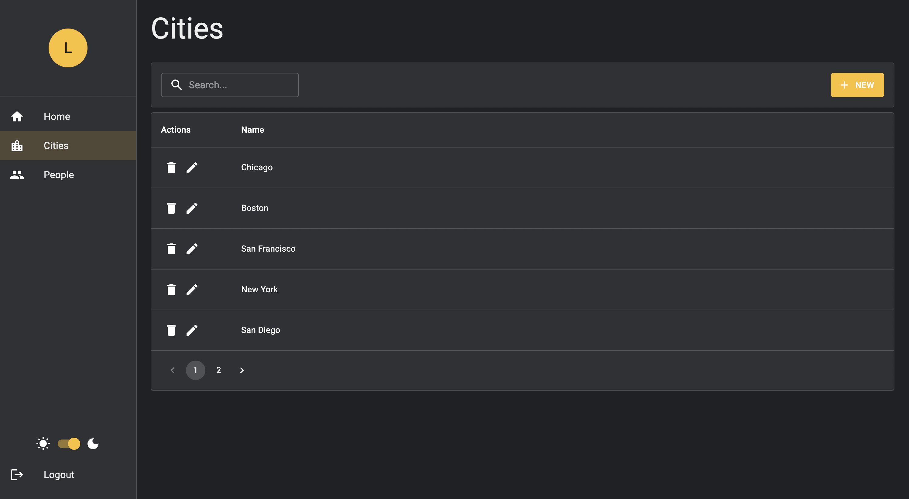
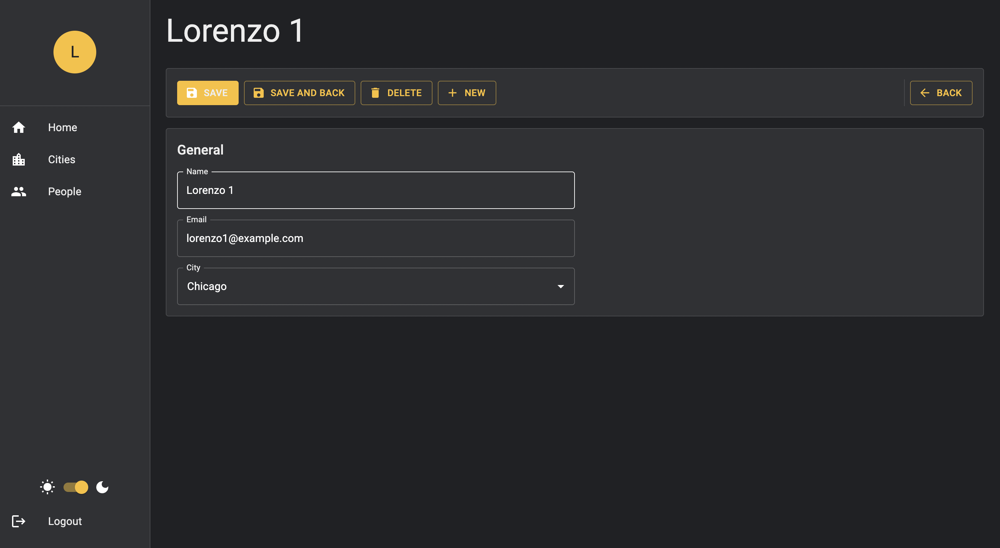
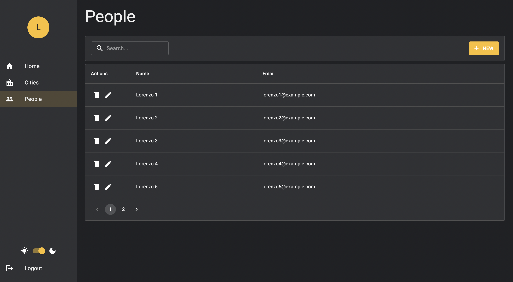
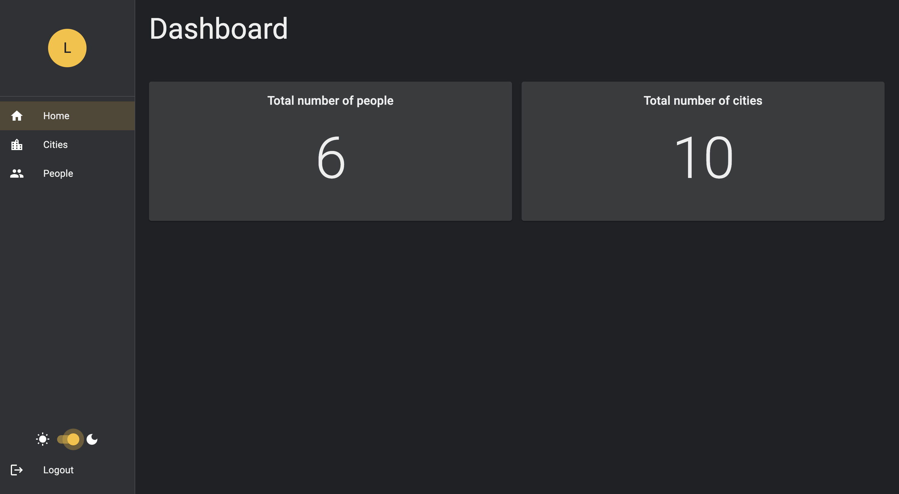

# Sample frontend project

## 1. About

This project was inspired by this [tutorial](https://www.youtube.com/playlist?list=PL29TaWXah3iaqOejItvW--TaFr9NcruyQ).

## 2. Technologies used

- [React](https://reactjs.org/): Frontend framework
- [React Router Dom](https://v5.reactrouter.com/): Routing for SPA
- [Material UI](https://mui.com/): Component library
- [ESLint](https://eslint.org/): Linter
- [Unform](https://github.com/unform/unform): High performance Forms
- [Yup](https://github.com/jquense/yup): Form validation
- [TypeScript](https://www.typescriptlang.org/): Typed version of JavaScript which provides better codebase scalability
- [Json Server](https://github.com/typicode/json-server): For mocking a backend
- [Axios](https://axios-http.com/docs/intro): For sending requests

## 3. Features

- Fake Restful API backend
- List and Detail pages for people and cities.
- Dashboard page.
- Light and Dark themes.
- All pages are responsive.
- Implements a relation between People and Cities.
- City Autocomplete field within People form.

## 4. Available Scripts

You should run the two commands below to make sure the application works correctly.

### Start

```
yarn start
```

Runs the app in the development mode.\
Open [localhost:3000](http://localhost:3000) to view it in the browser.

### Json Server

```
yarn mock
```

Starts a mocked backend that runs on [localhost:3333](http://localhost:3333).

## 5. Screenshots dark theme

|                                                             |                                                         |
| :---------------------------------------------------------: | :-----------------------------------------------------: |
|  |  |
|  |  |



## 6. Future improvements

- Add a beautiful modal for confirming record deletion
- Improve API architecture
  - Reduce code repetition
- Place all user messages into Environment
- Pagination is debouncing, which is not needed. Remove it...
- Show multiple errors in the forms (each error on it's own line)
- Improve Authentication System
  - Navigate user to `/login`
  - Create a better structure that makes it easier to create public and private pages
- Create a storage module
- Implement a component to Flash Messages
